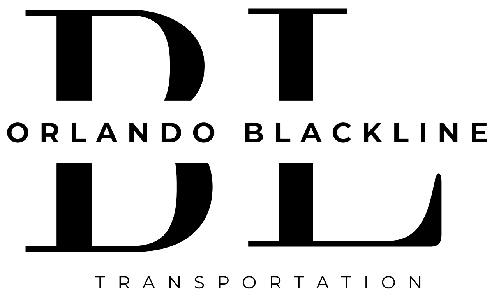

# Orlando Blackline Transportation

<div align="center">
  
  
  <p>A premium, high-performance web platform for Orlando's leading executive transportation service.</p>
</div>

---

## 🏎️ Overview

This repository contains the frontend application for Orlando Blackline. The goal of this project was to create a digital experience that mirrors the luxury of the physical service. We moved away from generic template builders and built a bespoke, highly optimized React application from the ground up.

Key focuses included:
- **Silky Smooth Animations:** Leveraging GSAP for scroll-triggered reveals without compromising mobile performance.
- **Conversion-Optimized Booking:** An integrated, slide-out booking portal that keeps users on the page.
- **Mobile-First Scrolling:** Completely custom mobile scroll physics handling to avoid iOS address bar jank.

## 🛠️ Tech Stack

- **Framework:** React 18 + Vite
- **Styling:** Tailwind CSS (Utility-first, easily maintainable)
- **Animation Engine:** GSAP (ScrollTrigger)
- **Typography/Icons:** Manrope Font, Lucide React
- **Deployment:** Firebase Hosting

## 🚀 Local Development

To get the project running locally:

1. **Clone the repository:**
   ```bash
   git clone https://github.com/xenoaitham/orlando-blackline.git
   cd orlando-blackline
   ```

2. **Install dependencies:**
   We recommend using `npm` or `yarn`.
   ```bash
   npm install
   ```

3. **Start the development server:**
   ```bash
   npm run dev
   ```

4. **Build for production:**
   ```bash
   npm run build
   ```

## 🏗️ Architecture & Technical Decisions

- **GSAP on Mobile:** We intentionally disable GSAP `scrub` functionality on touch devices. This prevents layout thrashing when mobile browsers dynamically resize the viewport (showing/hiding the address bar) while scrolling.
- **Booking Integration:** The booking system uses a 3rd party iframe. To prevent layout shifts and scroll-hijacking, the iframe is mounted inside a fixed `100dvh` modal overlay (`BookingPanel.tsx`) that slides in smoothly.
- **Overscroll Containment:** Replaced traditional `overflow-x: hidden` with `overflow-x: clip` and `overscroll-behavior-y: none` on the root body to ensure native iOS elastic scrolling doesn't trap users in nested scroll containers.

## 🌐 Live Environment
The production build is currently deployed and live at:
[https://orlandoblacklinetransportation.com](https://orlandoblacklinetransportation.com/)

---
*Built with precision for Central Florida.*
